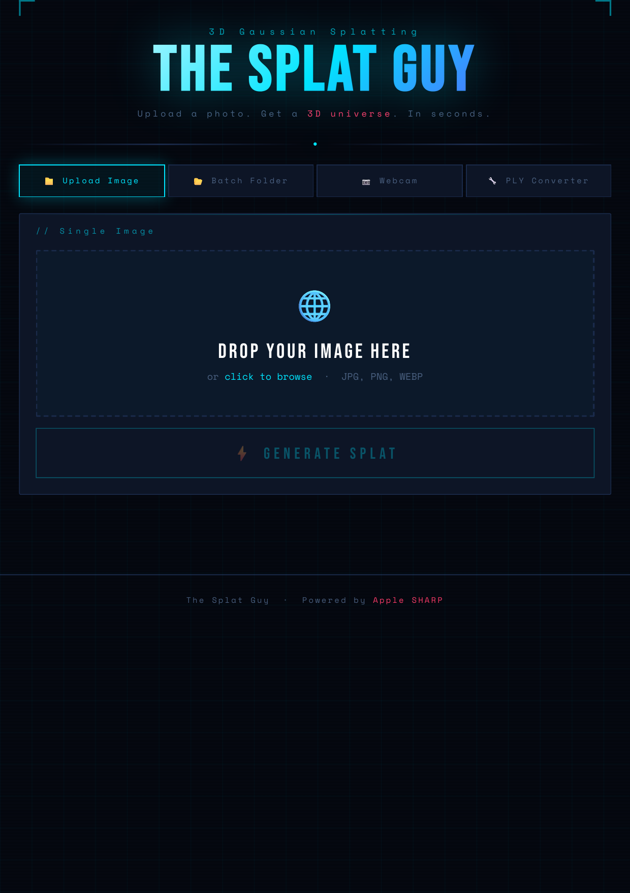
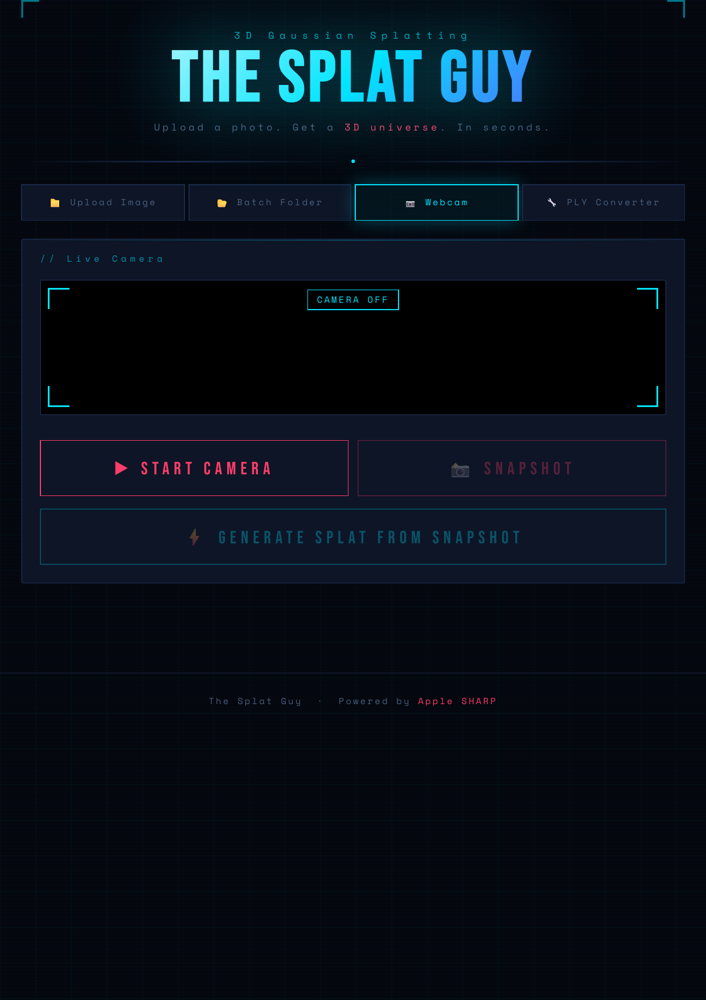
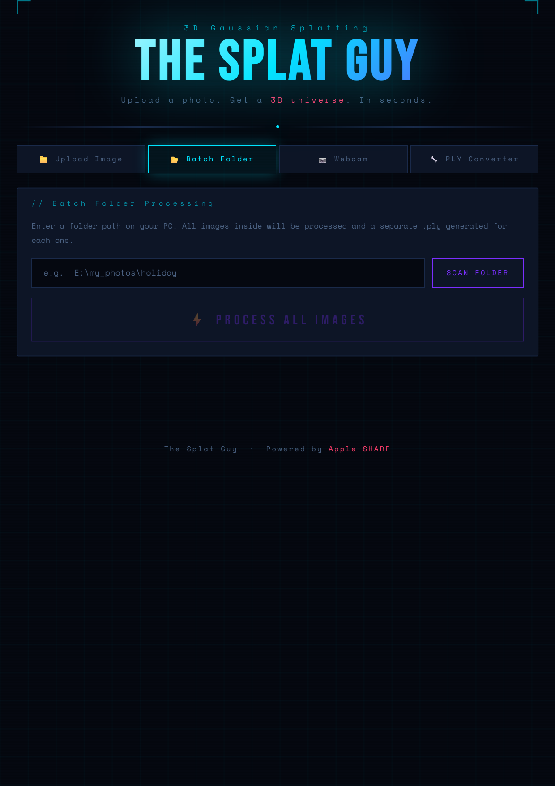
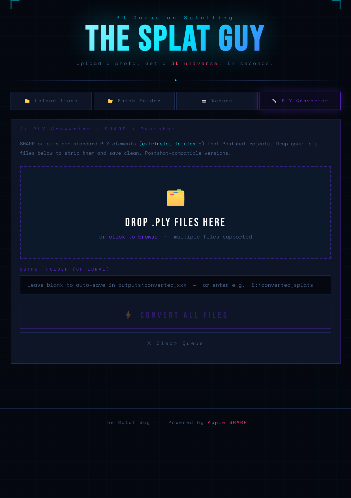

# The Splat Guy

A WebUI wrapper for [Apple SHARP](https://github.com/apple/ml-sharp) — single image to 3D Gaussian Splat in seconds.

Built by [Stephen Ryan](https://www.flamered.co.uk) / [@flame_red_images](https://instagram.com/flame_red_images)


---

## What It Does

SHARP (Single-image Human-centric Articulated Reconstruction and Processing) is Apple's ML model for reconstructing a 3D Gaussian Splat from a single photograph. This project wraps it in a local web interface with additional tooling:

- **Upload Image** — drag and drop a single photo, generate a `.ply` splat
- **Batch Folder** — point it at a folder of images and process them all
- **Webcam** — snapshot from your camera or OBS virtual camera directly to splat
- **PLY Converter** — strips non-standard elements (`extrinsic`, `intrinsic`) from SHARP output so files load correctly in [Postshot](https://www.jawset.com/)
- **Inline 3D Viewer** — preview your splat directly in the browser after generation

---

## Screenshots

<table>
  <tr>
    <td width="50%"></td>
    <td width="50%"></td>
  </tr>
  <tr>
    <td align="center"><sub>Upload Image</sub></td>
    <td align="center"><sub>Webcam</sub></td>
  </tr>
  <tr>
    <td width="50%"></td>
    <td width="50%"></td>
  </tr>
  <tr>
    <td align="center"><sub>Batch Folder</sub></td>
    <td align="center"><sub>PLY Converter</sub></td>
  </tr>
</table>


---

## Requirements

- Windows 10/11
- Python 3.10, 3.12, or 3.13
- Apple SHARP installed via pip (see below)
- Flask (`pip install flask`)

---

## Installation

### 1. Install Apple SHARP

Follow the official instructions at [github.com/apple/ml-sharp](https://github.com/apple/ml-sharp).

The short version:

```bash
pip install ml-sharp
```

Verify it works:

```bash
sharp --help
```

### 2. Clone or download this repo

```bash
git clone https://github.com/FlameredImages/the-splat-guy.git
cd the-splat-guy
```

Or click the green **Code** button above → **Download ZIP** and extract it.

### 3. Install dependencies

```bash
pip install flask
```

### 4. Run it

**Double-click `launch.bat`** — the server starts and your browser opens automatically at `http://127.0.0.1:7861`

Or from the command line:

```bash
python app.py
```

---

## Folder Structure

```
the-splat-guy/
├── app.py                  # Flask server — all routes and logic
├── launch.bat              # Windows launcher
├── install.bat             # Installs Flask dependency
├── templates/
│   └── index.html          # Full web UI (single file, no build step)
├── static/
│   └── splat.js            # Self-hosted WebGL Gaussian Splat viewer
├── screenshots/            # Repo screenshots
├── uploads/                # Created automatically at runtime
└── outputs/                # Generated .ply files stored here
```

---

## Usage

### Single Image
1. Click the **Upload Image** tab
2. Drag and drop or browse for a JPG, PNG, or WEBP
3. Click **Generate Splat**
4. Preview in the inline 3D viewer, download the `.ply`, or open in SuperSplat

### Batch Processing
1. Click the **Batch Folder** tab
2. Enter a full folder path (e.g. `E:\my_photos\shoot`)
3. Click **Scan Folder** to preview the images found
4. Click **Process All Images**
5. Each image gets its own `.ply` in the outputs folder

### Webcam / OBS
1. Click the **Webcam** tab
2. Click **Start Camera** — works with physical cameras and OBS Virtual Camera
3. Click **Snapshot** then **Generate Splat**

### PLY Converter (Postshot compatibility)
SHARP outputs non-standard PLY elements (`extrinsic`, `intrinsic`) that Postshot rejects. The converter strips these:

1. Click the **PLY Converter** tab
2. Drag in your `.ply` files (multiple supported)
3. Optionally set an output folder
4. Click **Convert All Files**

---

## Notes on the Inline Viewer

The built-in WebGL viewer (`static/splat.js`) is a minimal custom renderer — it reads the PLY directly from the local Flask server, so no internet connection is needed. It supports:

- Drag to orbit
- Scroll to zoom
- Right-drag to dolly

For more advanced viewing, the **Open in SuperSplat** button downloads the `.ply` and opens [SuperSplat](https://playcanvas.com/supersplat/editor) — drag the downloaded file into the browser window.

---

## Attribution

This project is a UI wrapper and tooling layer built on top of Apple's SHARP model.

**Apple SHARP**
- Repository: [https://github.com/apple/ml-sharp](https://github.com/apple/ml-sharp)
- License: [Apple Sample Code License](https://github.com/apple/ml-sharp/blob/main/LICENSE)
- Paper: *SHARP: Single-image Human-centric Articulated Reconstruction and Processing*

The SHARP model and all associated ML components remain the intellectual property of Apple Inc. and are used here in accordance with their licence terms. This wrapper project does not modify, redistribute, or bundle the SHARP model or weights.

---

## License

The code in this repository (the Flask app, web UI, PLY converter, and WebGL viewer) is released under the **MIT License** — see [LICENSE](LICENSE).

The underlying SHARP model is subject to Apple's licence. Please review [https://github.com/apple/ml-sharp/blob/main/LICENSE](https://github.com/apple/ml-sharp/blob/main/LICENSE) before any use.

---

## About

Built by Stephen Ryan — compositor, VFX artist, and visual experimenter based in Bristol.

I've been working with Gaussian splatting for a while, and this project grew out of wanting a faster path from a single image to a usable splat — no multi-camera rig, no capture session. SHARP makes that possible. The Splat Guy is the tooling I built around it.

- Website: [flamered.co.uk](https://www.flamered.co.uk)
- Instagram: [@flame_red_images](https://instagram.com/flame_red_images)
